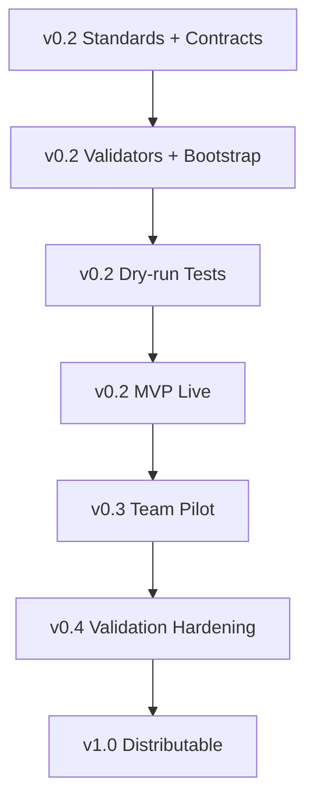

# Planning & Financial Control Power — Roadmap

## Release target

```txt
v0.2 = MVP live foundation
v0.3 = team pilot
v0.4 = validation hardening
v1.0 = distributable Power
```

## v0.2 — MVP Live Foundation

Target readiness: `>= 3.7 / 5`

Scope:

```txt
- Power planning control files
- run graph policy
- complex use-case gate
- baseline creation standard
- contract-driven runtime
- minimum DL Skill contracts
- graph and contract validation scripts
- workspace bootstrap scripts
- dry-run scenario tests
- README live usage
```

Exit gate:

```txt
[ ] clean workspace can install Power templates
[ ] Project Control Graph validates
[ ] DL Skill contracts validate
[ ] UC-00 baseline dry-run passes
[ ] contract-driven execution passes
[ ] circuit breaker blocks unsupported official claims
[ ] readiness score >= 3.7
```

## v0.3 — Team Pilot

Target readiness: `>= 4.0 / 5`

Scope:

```txt
- hook schema verification
- corrected hook templates
- more expected outputs
- memory/history schemas
- sample real project walkthrough
- team usage checklist
- BCBS239 report quality checklist
- milestone delay and budget cut dry-runs
```

Exit gate:

```txt
[ ] one non-author user can follow install guide
[ ] one real project can run M0/M1/M2 workflows
[ ] one report produced with control header
[ ] all critical blockers are tracked
```

## v0.4 — Validation Hardening

Target readiness: `>= 4.3 / 5`

Scope:

```txt
- automated test runner
- schema test suite
- contract maturity scoring
- trap tests for hallucination
- trap tests for stale memory
- trap tests for history-as-truth
- trap tests for fake RAG/fake budget
```

Exit gate:

```txt
[ ] automated validation can run locally
[ ] trap tests fail unsafe outputs
[ ] scorecard maps score to evidence/tests
```

## v1.0 — Distributable Power

Target readiness: `>= 4.5 / 5`

Scope:

```txt
- versioned package
- full documentation
- install/uninstall scripts
- tested hooks
- example project
- full P0/P1 DL Skill contracts
- stable templates
- release notes
```

Exit gate:

```txt
[ ] installable by another user without author guidance
[ ] all examples pass
[ ] no P0/P1 blockers open
[ ] README and source manifest complete
[ ] changelog and migration notes complete
```

## Roadmap dependency chain



## Current focus

```txt
Finish v0.2.
Do not expand to integrations before foundation is live.
```
