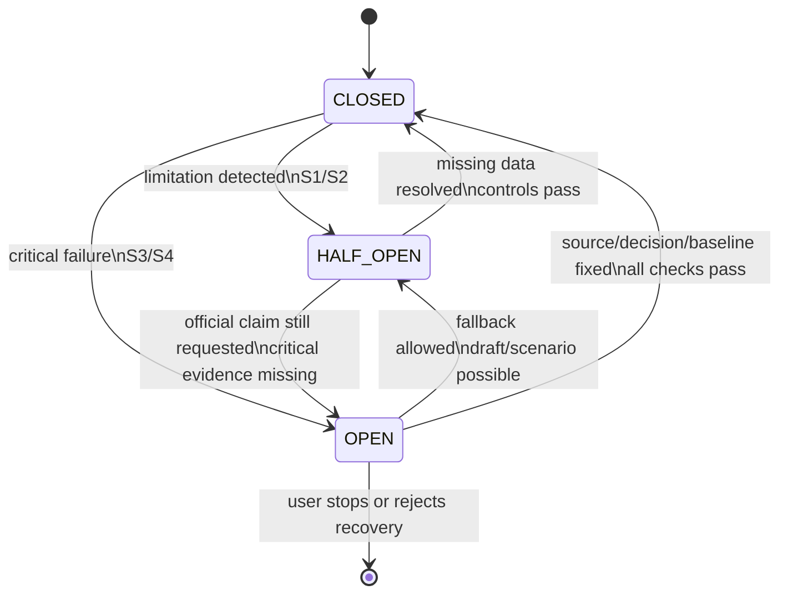

# Circuit Breaker State Machine

Version: 0.1
Scope: Planning & Financial Control Power

## Purpose

The Circuit Breaker decides whether a Power output can be official, downgraded, or blocked.

It evaluates Power-owned controls after DL Skill outputs are validated.

## States

| State | Meaning | Output authority |
|---|---|---|
| CLOSED | All required controls pass | Official output allowed if readiness mode permits |
| HALF_OPEN | Some limitations or missing data exist | Draft/scenario output only |
| OPEN | Critical control failed | Official claims blocked |

## Severity

| Severity | Meaning | Behavior |
|---|---|---|
| S0 | No issue | Continue |
| S1 | Minor issue | Continue with note |
| S2 | Confidence limitation | Draft only |
| S3 | Official claim blocked | Block official output |
| S4 | Unsafe contradiction | Stop workflow and require resolution |

## Breaker types

| Breaker | Opens when |
|---|---|
| Baseline breaker | Official baseline/RAG/report requested without controlled baseline |
| Finance breaker | Budget/forecast claim requested without resource + rate + budget basis |
| Evidence breaker | Date/cost/status/resource claim lacks support |
| Context breaker | Stale/unlinked/conflicting context affects output |
| Cascade breaker | Changed node did not propagate to linked nodes |
| History-bias breaker | Historical benchmark used as current truth |
| Contract breaker | DL Skill preconditions/postconditions fail |

## State transitions



## Evaluation order

```txt
1. Contract breaker
2. Baseline breaker
3. Finance breaker
4. Cascade breaker
5. Context breaker
6. History-bias breaker
7. Evidence breaker
```

Reason: contract/baseline/finance/cascade failures can invalidate downstream evidence checks.

## Required breaker output

```txt
Breaker:
State:
Severity:
Reason:
Blocked claims:
Missing data:
Allowed fallback:
Recovery questions:
Next action:
```

## Contract breaker rule

Open Contract breaker when:

```txt
- skill is not registered
- required input missing
- forbidden input passed
- output format invalid
- produced delta targets unauthorized graph node
- skill exceeds authority limit
```

## Breaker to output mapping

| State | Output behavior |
|---|---|
| CLOSED | produce requested output, or write approved delta |
| HALF_OPEN | produce draft/scenario with limitations and blocked claims |
| OPEN | block official output and return recovery path |

## Recovery rule

When OPEN:

```txt
1. Do not continue official workflow.
2. Do not silently fill missing data.
3. Return allowed fallback if safe.
4. Ask only critical recovery questions.
5. Log breaker event.
```
