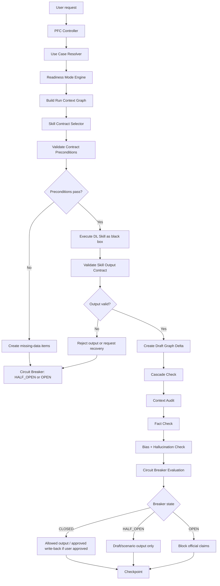

# PFC Runtime Execution Engine

Version: 0.1
Scope: Planning & Financial Control Power

## Purpose

This document defines how the Power executes a user request while treating DL Skills as external black-box capabilities.

```txt
Power owns orchestration, graph, validation, and control.
DL Skills only execute bounded transformations under contract.
```

## Runtime pipeline

```txt
1. Receive user request
2. Resolve use case
3. Select readiness mode
4. Build Run Context Graph
5. Select DL Skill contracts
6. Validate skill preconditions
7. Execute skills in controlled sequence
8. Validate skill outputs against contracts
9. Merge outputs into draft graph delta
10. Run cascade/context/fact/bias/hallucination checks
11. Run Circuit Breaker
12. Decide output/write-back authority
13. Create checkpoint/audit record
```

## Mermaid runtime flow



## Runtime objects

| Object | Owner | Purpose |
|---|---|---|
| User request | user | intent source |
| Use case | Power | defines job being performed |
| Readiness mode | Power | defines output authority |
| Project Control Graph | Power | persistent source of truth |
| Run Context Graph | Power | temporary scoped context for one run |
| DL Skill Contract | Power registry | declares what external skill can do |
| Skill output | DL Skill | black-box result |
| Draft graph delta | Power | proposed graph mutation |
| Circuit Breaker result | Power | allow/downgrade/block decision |
| Checkpoint | Power | audit trail |

## Run types

| Run type | Description | Write behavior |
|---|---|---|
| read_only | answer from graph | no write |
| draft | create draft graph delta | no persistent write unless user approves |
| scenario | hypothetical analysis | no persistent write |
| controlled_update | approved update to graph | write approved delta |
| baseline_freeze | freeze controlled baseline | write baseline version + checkpoint |

## Skill execution rule

```txt
A DL Skill may only be executed if:
1. It is listed in contract registry.
2. Required inputs are available in Run Context Graph or provided by user.
3. Preconditions are satisfied or downgraded with explicit assumptions.
4. Its output authority is compatible with readiness mode.
```

## Result validation rule

After every skill execution, the Power must validate:

```txt
1. Required outputs exist.
2. Output format is usable.
3. Output does not exceed skill authority.
4. Produced graph deltas target allowed node types.
5. Dates/cost/status/resource claims have support.
6. Missing information is represented as missing data or assumption.
```

## Write-back rule

```txt
DL Skills never write directly to Project Control Graph.
DL Skills return proposed deltas.
Power decides if deltas are accepted, downgraded, rejected, or checkpointed.
```

## Output authority rule

| Mode | Allowed authority |
|---|---|
| M0 | skeleton, questions, missing data |
| M1 | draft planning/reporting |
| M2 | forecast/scenario with assumptions |
| M3 | official baseline/report if controls pass |

## Failure handling

If any stage fails:

```txt
1. Open relevant Circuit Breaker.
2. Block unsupported official claims.
3. Return allowed fallback.
4. Ask only critical recovery questions.
5. Log missing data / contract failure.
```
