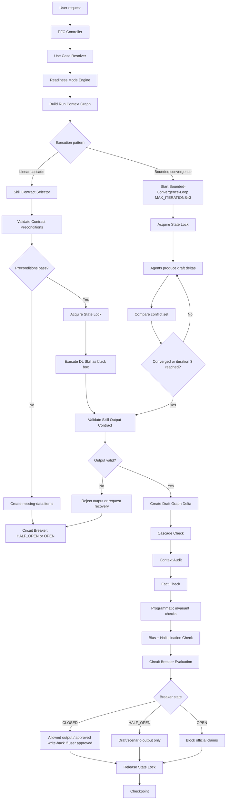

# PFC Runtime Execution Engine

Version: 0.2
Scope: Planning & Financial Control Power

## Purpose

This document defines how the Power executes a user request while treating DL Skills as external black-box capabilities.

```txt
Power owns orchestration, graph, validation, state locking, and control.
DL Skills only execute bounded transformations under contract.
```

## Runtime pipeline

```txt
1. Receive user request
2. Resolve use case
3. Select readiness mode
4. Build Run Context Graph
5. Select execution pattern: Linear Cascade or Bounded-Convergence-Loop
6. Select DL Skill contracts
7. Validate skill preconditions
8. Acquire State Lock before any controlled write path
9. Execute skills in controlled sequence or bounded convergence loop
10. Validate skill outputs against contracts
11. Merge outputs into draft graph delta
12. Run cascade/context/fact/bias/hallucination checks
13. Run deterministic programmatic checks
14. Run Circuit Breaker
15. Decide output/write-back authority
16. Release State Lock
17. Create checkpoint/audit record
```

## Mermaid runtime flow



## Runtime objects

| Object | Owner | Purpose |
|---|---|---|
| User request | user | intent source |
| Use case | Power | defines job being performed |
| Readiness mode | Power | defines output authority |
| Project Control Graph | Power | persistent source of truth |
| Run Context Graph | Power | temporary scoped context for one run |
| DL Skill Contract | Power registry | declares what external skill can do |
| Skill output | DL Skill | black-box result |
| Draft graph delta | Power | proposed graph mutation |
| State Lock | Power | prevents concurrent conflicting graph writes |
| Circuit Breaker result | Power | allow/downgrade/block decision |
| Checkpoint | Power | audit trail |

## Run types

| Run type | Description | Write behavior |
|---|---|---|
| read_only | answer from graph | no write |
| draft | create draft graph delta | no persistent write unless user approves |
| scenario | hypothetical analysis | no persistent write |
| controlled_update | approved update to graph | write approved delta |
| baseline_freeze | freeze controlled baseline | write baseline version + checkpoint |
| bounded_convergence | bounded negotiation between conflicting agents | draft deltas only until convergence and approval |

## Bounded-Convergence-Loop execution

Use this pattern when agents produce conflicting deltas that are both plausible and linked.

Examples:

```txt
finance-analyst proposes budget cut
resource-planner detects capacity conflict
timeline-planner proposes milestone shift
report-builder must not publish until conflict is resolved
```

Hard limit:

```txt
MAX_ITERATIONS = 3
```

Loop algorithm:

```txt
1. Build one scoped Run Context Graph snapshot.
2. Acquire State Lock.
3. Run participating agents against the same snapshot.
4. Collect only structured draft deltas, not long prose.
5. Compare deltas against graph schema, contract, BCBS239 tags, and deterministic invariants.
6. If conflicts remain and iteration < 3, send only the conflict set back to participating agents.
7. If converged, create one merged draft delta.
8. If not converged by iteration 3, stop and open Cascade/Contract breaker.
9. Release State Lock after write-back decision or block.
```

Forbidden:

```txt
unbounded back-and-forth agent debate
full conversation replay into every iteration
writing partial convergence deltas directly to project-control.yaml
inventing a compromise after iteration 3
```

## State Lock mechanism

Purpose:

```txt
Prevent concurrent, conflicting writes to templates/project-control.yaml or .pm/control/project-control.yaml during negotiation and controlled updates.
```

Lock scope:

```txt
Project Control Graph write path
baseline freeze
controlled_update
bounded_convergence
forecast/cost recalculation write-back
```

Recommended lock file:

```txt
.pm/control/.project-control.lock
```

Required lock fields:

```yaml
lock_id: LOCK-YYYYMMDD-HHMMSS-uuid
run_id: RUN-...
owner_agent: pm-controller
execution_pattern: bounded_convergence
locked_file: .pm/control/project-control.yaml
created_at: ISO-8601
expires_at: ISO-8601
state_hash_before: sha256
status: active
```

State lock rules:

```txt
1. Only PM Controller may acquire or release the State Lock.
2. Agents may read the locked graph snapshot but cannot write the persistent graph.
3. All agent outputs during lock are draft deltas.
4. A lock must include state_hash_before.
5. Before write-back, recompute state hash; if changed, abort write-back and open Contract/Baseline breaker.
6. Expired locks may be recovered only by PM Controller with checkpoint evidence.
7. Lock release must write lock outcome to run execution record and agent action log.
```

Lock failure behavior:

| Failure | Required behavior |
|---|---|
| lock exists and active | downgrade to read_only/scenario or wait; do not write |
| lock expired | create recovery checkpoint before acquiring replacement lock |
| state hash changed | block write-back and reopen Run Context Graph |
| release failed | mark audit gap and keep graph unchanged |

## Skill execution rule

```txt
A DL Skill may only be executed if:
1. It is listed in contract registry.
2. Required inputs are available in Run Context Graph or provided by user.
3. Preconditions are satisfied or downgraded with explicit assumptions.
4. Its output authority is compatible with readiness mode.
5. Its output can be validated without loading full trailing conversation history.
```

## Result validation rule

After every skill execution, the Power must validate:

```txt
1. Required outputs exist.
2. Output format is usable.
3. Output does not exceed skill authority.
4. Produced graph deltas target allowed node types.
5. Dates/cost/status/resource claims have support.
6. Missing information is represented as missing data or assumption.
7. BCBS239 principle tags are present in action logs.
8. Deterministic finance totals reconcile before any cost/budget write-back.
```

## Write-back rule

```txt
DL Skills never write directly to Project Control Graph.
DL Skills return proposed deltas.
Power decides if deltas are accepted, downgraded, rejected, or checkpointed.
```

Write-back requires:

```txt
State Lock acquired
breaker CLOSED
user approval if persistent graph mutation is requested
schema validation passed
programmatic invariants passed
BCBS239 lineage tags present
state_hash_before still matches
```

## Output authority rule

| Mode | Allowed authority |
|---|---|
| M0 | skeleton, questions, missing data |
| M1 | draft planning/reporting |
| M2 | forecast/scenario with assumptions |
| M3 | official baseline/report if controls pass |

## Failure handling

If any stage fails:

```txt
1. Open relevant Circuit Breaker.
2. Isolate and condense failure context.
3. Block unsupported official claims.
4. Return allowed fallback.
5. Ask only critical recovery questions.
6. Log missing data / contract failure.
7. Release State Lock if held.
```
