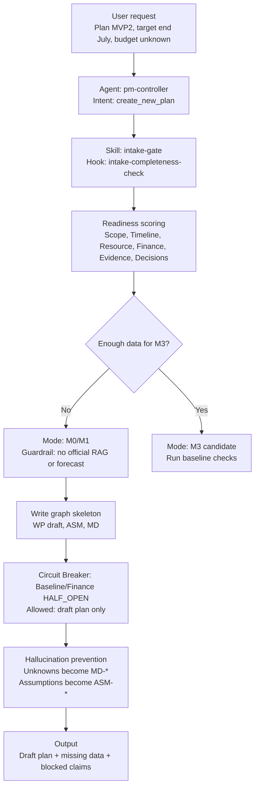
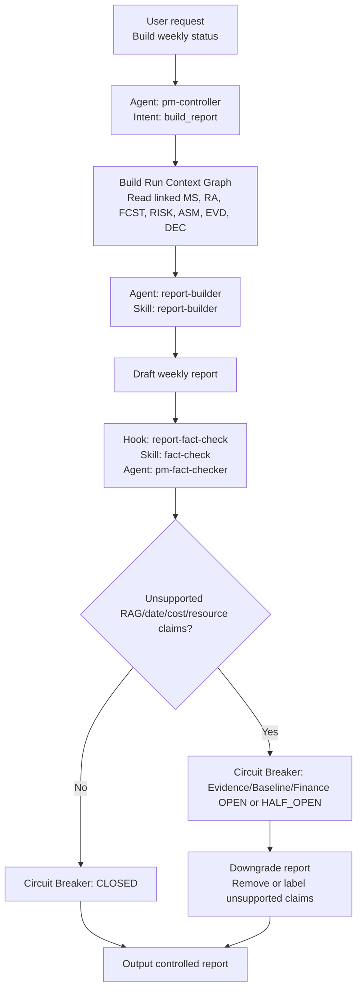
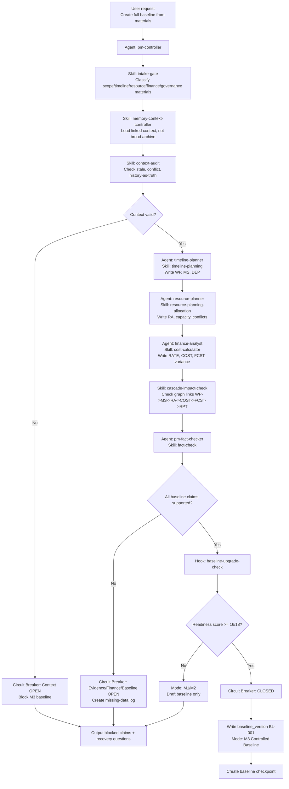
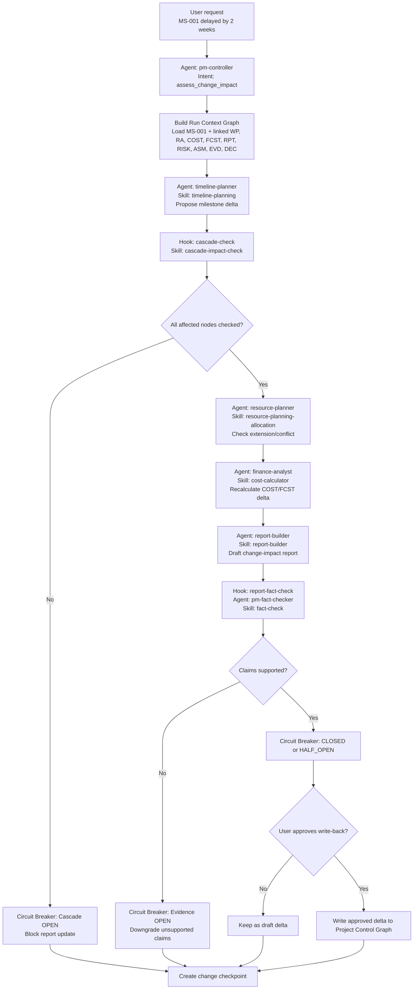
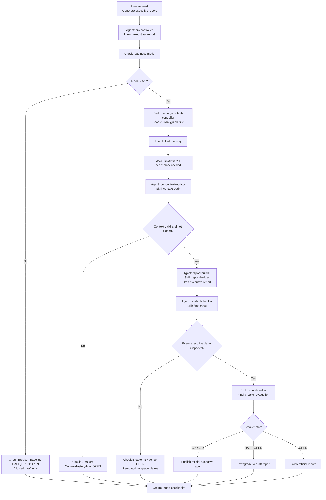
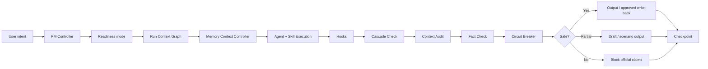

# Critical Flows With Controls

This reference shows the mechanisms of the Planning & Financial Control Power with explicit agents, skills, hooks, circuit breakers, guardrails, bias controls, and hallucination controls.

## Flow 1 — Simple: Start project with incomplete data

### Control block

| Control | Detail |
|---|---|
| Agent | `pm-controller` |
| Skill | `intake-gate`, optional `memory-context-controller` |
| Hook | `intake-completeness-check` |
| Breaker | Baseline breaker, Finance breaker |
| Guardrail | Ask max 5 questions; no official RAG/forecast |
| Bias control | Do not infer from past projects |
| Hallucination control | Unknown = `MD-*`; assumption = `ASM-*` |

---

## Flow 2 — Simple: Generate draft weekly report

### Control block

| Control | Detail |
|---|---|
| Agent | `report-builder`, `pm-fact-checker` |
| Skill | `report-builder`, `fact-check`, `circuit-breaker` |
| Hook | `report-fact-check`, `circuit-breaker-check` |
| Breaker | Evidence, Baseline, Finance |
| Guardrail | Report status must be source-linked |
| Bias control | No greenwashing; include risks/missing data |
| Hallucination control | Every RAG claim requires graph/source support |

---

## Flow 3 — Complex: Create full controlled baseline

### Control block

| Control | Detail |
|---|---|
| Agents | `pm-controller`, `timeline-planner`, `resource-planner`, `finance-analyst`, `pm-context-auditor`, `pm-fact-checker` |
| Skills | `intake-gate`, `memory-context-controller`, `context-audit`, `timeline-planning`, `resource-planning-allocation`, `cost-calculator`, `cascade-impact-check`, `fact-check`, `circuit-breaker` |
| Hooks | `intake-completeness-check`, `context-audit`, `cascade-check`, `baseline-upgrade-check`, `circuit-breaker-check` |
| Breakers | Baseline, Finance, Evidence, Context, History-bias |
| Guardrails | M3 requires score >= 16/18 and supported baseline nodes |
| Bias control | History cannot fill missing baseline fields |
| Hallucination control | Every baseline node must have source/assumption/decision/derived support |

---

## Flow 4 — Complex: Milestone delay full cascade

### Control block

| Control | Detail |
|---|---|
| Agents | `pm-controller`, `timeline-planner`, `resource-planner`, `finance-analyst`, `report-builder`, `pm-fact-checker` |
| Skills | `timeline-planning`, `cascade-impact-check`, `resource-planning-allocation`, `cost-calculator`, `report-builder`, `fact-check`, `circuit-breaker` |
| Hooks | `cascade-check`, `report-fact-check`, `circuit-breaker-check` |
| Breakers | Cascade, Evidence, Finance, Baseline |
| Guardrails | No direct report update after milestone change |
| Bias control | Do not assume cost impact zero or recovery easy |
| Hallucination control | Impact must derive from linked RA/COST/FCST/RPT nodes |

---

## Flow 5 — Complex: Executive report with memory/history controls

### Control block

| Control | Detail |
|---|---|
| Agents | `pm-controller`, `report-builder`, `pm-context-auditor`, `pm-fact-checker` |
| Skills | `memory-context-controller`, `context-audit`, `report-builder`, `fact-check`, `circuit-breaker` |
| Hooks | `context-audit`, `report-fact-check`, `circuit-breaker-check` |
| Breakers | Baseline, Evidence, Finance, Context, History-bias |
| Guardrails | Official executive report requires M3 and fact-check pass |
| Bias control | Include counter-signals: risks, issues, missing data, unfavorable variance |
| Hallucination control | Every executive claim links to graph node/source |

---

## Final mechanism summary

